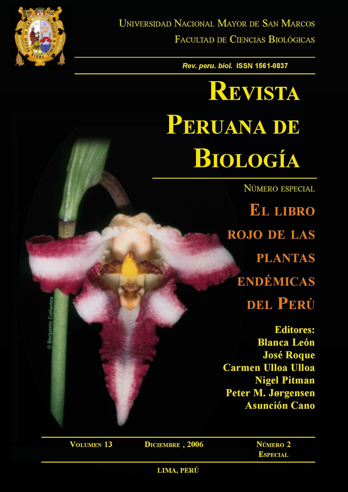

<!-- README.md is generated from README.Rmd. Please edit that file -->

# redbookperu <a href='https://github.com/PaulESantos/redbookperu'></a>

<!-- badges: start -->

[](https://lifecycle.r-lib.org/articles/stages.html#stable)
[](https://CRAN.R-project.org/package=redbookperu)
[](https://app.codecov.io/gh/PaulESantos/redbookperu?branch=main)
[](https://github.com/PaulESantos/redbookperu/actions/workflows/R-CMD-check.yaml)
<!-- badges: end -->

The R package `redbookperu` provides convenient access to the
information contained in the [Red Book of Endemic Plants of
Peru](https://revistasinvestigacion.unmsm.edu.pe/index.php/rpb/issue/view/153).
This book represents a comprehensive compilation of data on Peru’s
endemic plant species, encompassing records of 5,508 distinct taxa.
Although this document marked a milestone by consolidating an ambitious
initiative focused on understanding the diversity of Peru’s endemic
plant species at the time of its publication, it currently requires a
review and update of the presented taxonomic information.

The process of accessing data from the original publication can pose
challenges for researchers, particularly due to the large number of taxa
presented within it. The `redbookperu` package has the primary objective
of addressing these challenges by providing updated taxonomic
information. Additionally, it introduces functions designed to enhance
the accessibility and usefulness of the data presented in the Red Book
of Endemic Plants of Peru.

The information included in the `redbookperu` package is built with the
support of the [Taxonomic Name Resolution Service
TNRS](https://tnrs.biendata.org/), in collaboration with the [World
Checklist of Vascular Plants
WCVP](https://powo.science.kew.org/about-wcvp) database. These resources
are utilized to ensure the validity and standardization of the taxonomic
information that we provide.

### Installation

You can install the development version of `redbookperu` from GitHub:

``` r
pak::pak("PaulESantos/redbookperu")
```

### Getting Started

After installing the ppendemic package, you can load it into your R
session using:

``` r
library(redbookperu)
#> This is redbookperu 0.0.0.2
```

To determine if a species of interest is listed in the Red Book of
Endemic Plants of Peru, we provide the `check_redbook()` function. This
function verifies whether the species of interest is included in the
book’s species list. The function comes in two variations:

- `check_redbook(splist, tax_status == TRUE)`: The resulting information
  is structured as follows: “species name” - “taxonomic status” -
  “validation information”.
  - Species Name: Provides the currently accepted name for the species.
  - Taxonomic Status: Includes the following categories: “Accepted name”
    when the species name recorded remains valid currently, “Updated
    name” for species whose scientific name recorded at the time of
    publication is now considered synonymous, “No opinion” for species
    whose name presents difficulties in determining their current
    taxonomic status, and “Non info. available” for species for which
    updated information hasn’t been found in the WCVP database. When the
    species of interest doesn’t match the species list, the response is
    “Not endemic”.

``` r

splist <- c("Aphelandra cuscoenses", "Sanchezia capitata",
            "Sanchezia ovata", "Piper stevensi",
            "Verbesina andinaa", "Verbesina andina", "Weinmania nubigena")

check_redbook(splist, tax_status = TRUE)
#> [1] "Aphelandra cuscoensis - Accepted name - Fuzzy match"
#> [2] "Sanchezia ovata - Updated name"                     
#> [3] "Sanchezia ovata - Accepted name"                    
#> [4] "Piper stevensii - No opinion - Fuzzy match"         
#> [5] "Verbesina andina - No info. available - Fuzzy match"
#> [6] "Verbesina andina - No info. available"              
#> [7] "Weinmania nubigena - Not endemic"
```

- `check_redbook(splist, tax_status == FALSE)`: The result indicates
  whether the species is endemic or not, based on its match with the
  species present in the database.

``` r
check_redbook(splist, tax_status = FALSE)
#> [1] "Aphelandra cuscoensis is endemic - fuzzy macth"
#> [2] "Sanchezia ovata is endemic"                    
#> [3] "Sanchezia ovata is endemic"                    
#> [4] "Piper stevensii is endemic - fuzzy macth"      
#> [5] "Verbesina andina is endemic - fuzzy match"     
#> [6] "Verbesina andina is endemic"                   
#> [7] "Weinmania nubigena - Not endemic"
```

Both functions indicate the presence of partial matches (fuzzy match)
when the name of the species of interest varies compared to the
information present in the database.

`check_redbook()` function is designed to work seamlessly with tibbles,
allowing users to easily analyze species data within a tabular format.

``` r
tibble::tibble(splist = splist) |> 
  dplyr::mutate(endemic_tax_status = check_redbook(splist, tax_status = TRUE),
                endemic = check_redbook(splist, tax_status = FALSE))
#> # A tibble: 7 × 3
#>   splist                endemic_tax_status                               endemic
#>   <chr>                 <chr>                                            <chr>  
#> 1 Aphelandra cuscoenses Aphelandra cuscoensis - Accepted name - Fuzzy m… Aphela…
#> 2 Sanchezia capitata    Sanchezia ovata - Updated name                   Sanche…
#> 3 Sanchezia ovata       Sanchezia ovata - Accepted name                  Sanche…
#> 4 Piper stevensi        Piper stevensii - No opinion - Fuzzy match       Piper …
#> 5 Verbesina andinaa     Verbesina andina - No info. available - Fuzzy m… Verbes…
#> 6 Verbesina andina      Verbesina andina - No info. available            Verbes…
#> 7 Weinmania nubigena    Weinmania nubigena - Not endemic                 Weinma…
```
